# Fluxos do Checkout — versão Mermaid

Conversão dos diagramas `.drawio` desta pasta (10 diagramas de sequência em `Diagrama de sequencia/` + 13 fluxogramas em `Fluxogramas/`) para [Mermaid](https://mermaid.js.org/), que o GitHub renderiza nativamente em blocos ` ```mermaid `. Motivo da conversão: no XML do `.drawio` a ordem das mensagens depende de coordenadas x/y e IDs de `source`/`target` espalhados pelo arquivo — difícil de ler tanto para humano quanto para IA sem abrir no editor. Em Mermaid a ordem é literalmente a ordem das linhas do arquivo.

> **Notas de divergência/achado**, marcadas com ⚠️, apontam onde o diagrama original diverge do comportamento confirmado em `../ARCHITECTURE.md` e `../../.specs/project/STATE.md`, ou aponta um achado ainda não incorporado à arquitetura. Notas marcadas com ✅ indicam que o diagrama já está confirmado/alinhado com a arquitetura.

## Índice

**Diagramas de sequência** — [Login](#login) · [Consulta de cliente](#consulta-de-cliente) · [Consultar produtos](#consultar-produtos-sequência) · [Vender produtos](#vender-produtos-sequência) · [Cancelar produto](#cancelar-produto-sequência) · [Condição de pagamento](#condição-de-pagamento-sequência) · [Adiciona pagamentos](#adiciona-pagamentos) · [Descontos e acréscimos](#descontos-e-acréscimos-sequência) · [Emissão NFCe](#emissão-nfce) · [Importação e faturamento de DAV](#importação-e-faturamento-de-dav)

**Fluxogramas — Operador de Caixa** — [Fazer login](#fazer-login-operador) · [Identificar ou cadastrar cliente](#identificar-ou-cadastrar-cliente) · [Consultar produtos](#consultar-produtos-fluxograma) · [Vender produtos](#vender-produtos-fluxograma) · [Cancelar produtos](#cancelar-produtos-fluxograma) · [Selecionar condição de pagamento](#selecionar-condição-de-pagamento) · [Registrar pagamentos](#registrar-pagamentos) · [Aplicar descontos e acréscimos](#aplicar-descontos-e-acréscimos-fluxograma) · [DAV](#dav-fluxograma)

**Fluxogramas — Supervisor** — [Aprovar cancelamento](#aprovar-cancelamento) · [Aprovar desconto](#aprovar-desconto) · [Fazer login](#fazer-login-supervisor)

**Display secundário** — [Tela do cliente](#tela-do-cliente)

---

## Diagramas de sequência

### Login

Fonte: `Diagrama de sequencia/Login.drawio`. Abertura do Checkout até a tela inicial de vendas.

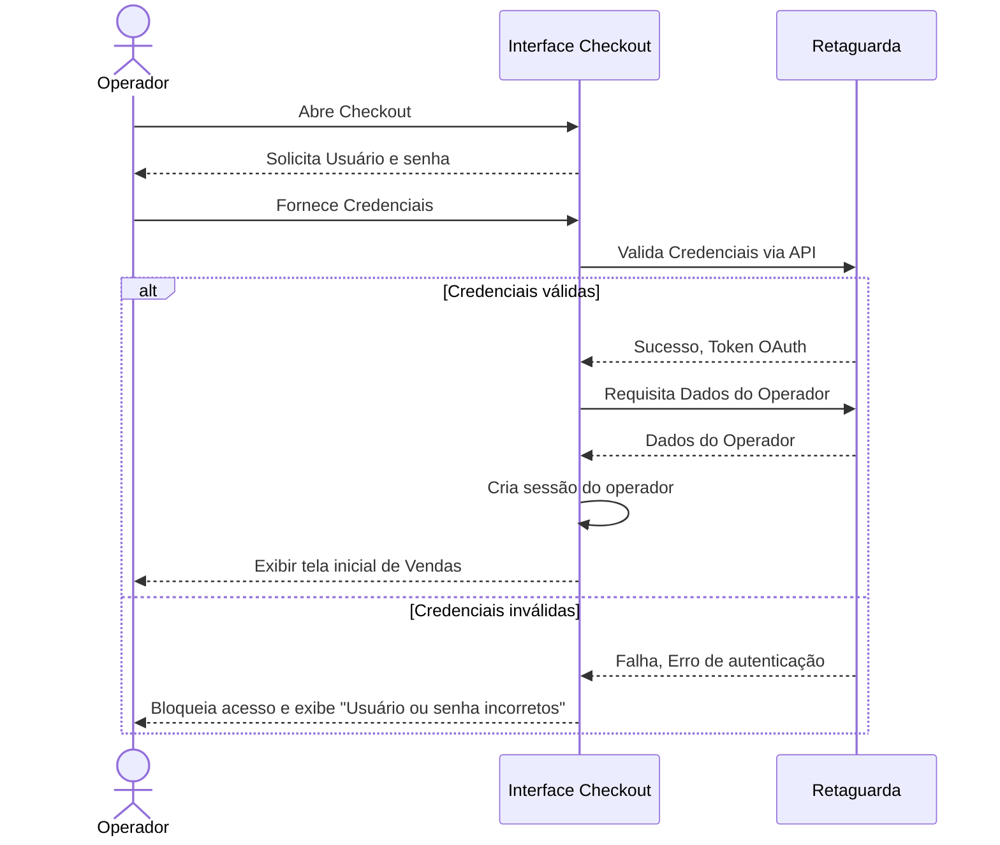
```mermaid
sequenceDiagram
    actor Operador
    participant Checkout as Interface Checkout
    participant Retaguarda

    Operador->>Checkout: Abre Checkout
    Checkout-->>Operador: Solicita Usuário e senha
    Operador->>Checkout: Fornece Credenciais
    Checkout->>Retaguarda: Valida Credenciais via API
    alt Credenciais válidas
        Retaguarda-->>Checkout: Sucesso, Token OAuth
        Checkout->>Retaguarda: Requisita Dados do Operador
        Retaguarda-->>Checkout: Dados do Operador
        Checkout->>Checkout: Cria sessão do operador
        Checkout-->>Operador: Exibir tela inicial de Vendas
    else Credenciais inválidas
        Retaguarda-->>Checkout: Falha, Erro de autenticação
        Checkout-->>Operador: Bloqueia acesso e exibe "Usuário ou senha incorretos"
    end
```

> ⚠️ **Divergência**: não reflete o comportamento real confirmado do Checkout — as credenciais chegam prontas via query parameters no redirecionamento do ERP (AD-002), não há tela de usuário/senha digitados pelo operador.

### Consulta de cliente

Fonte: `Diagrama de sequencia/Consulta de Cliente.drawio`. Busca por CPF e cadastro quando o cliente não é localizado.

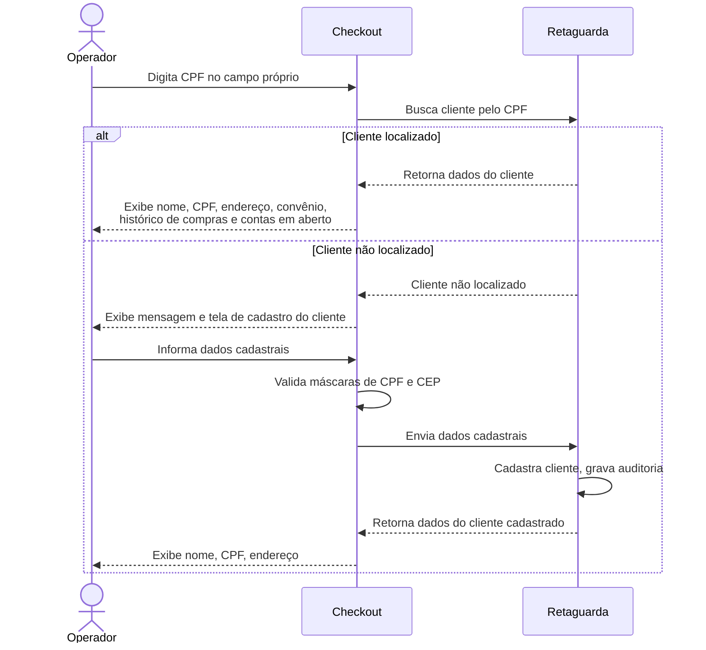
```mermaid
sequenceDiagram
    actor Operador
    participant Checkout
    participant Retaguarda

    Operador->>Checkout: Digita CPF no campo próprio
    Checkout->>Retaguarda: Busca cliente pelo CPF
    alt Cliente localizado
        Retaguarda-->>Checkout: Retorna dados do cliente
        Checkout-->>Operador: Exibe nome, CPF, endereço, convênio,<br/>histórico de compras e contas em aberto
    else Cliente não localizado
        Retaguarda-->>Checkout: Cliente não localizado
        Checkout-->>Operador: Exibe mensagem e tela de cadastro do cliente
        Operador->>Checkout: Informa dados cadastrais
        Checkout->>Checkout: Valida máscaras de CPF e CEP
        Checkout->>Retaguarda: Envia dados cadastrais
        Retaguarda->>Retaguarda: Cadastra cliente, grava auditoria
        Retaguarda-->>Checkout: Retorna dados do cliente cadastrado
        Checkout-->>Operador: Exibe nome, CPF, endereço
    end
```

> ✅ **Confirmado**: existência de cadastro simplificado de cliente pelo Checkout — ver `ARCHITECTURE.md` seção 5, item 3 e AD-011.

### Consultar produtos (sequência)

Fonte: `Diagrama de sequencia/COnsultar Produtos.drawio`. Busca por texto livre, paginada — usada no modal de pesquisa.

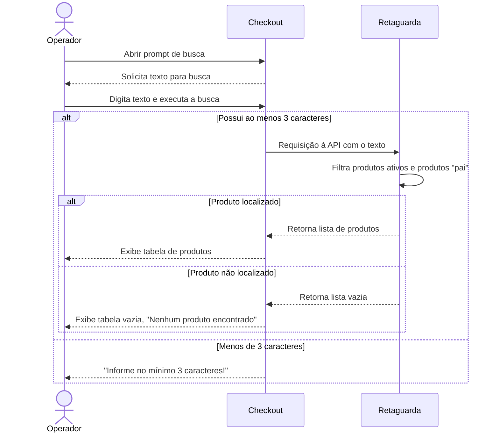
```mermaid
sequenceDiagram
    actor Operador
    participant Checkout
    participant Retaguarda

    Operador->>Checkout: Abrir prompt de busca
    Checkout-->>Operador: Solicita texto para busca
    Operador->>Checkout: Digita texto e executa a busca
    alt Possui ao menos 3 caracteres
        Checkout->>Retaguarda: Requisição à API com o texto
        Retaguarda->>Retaguarda: Filtra produtos ativos e produtos "pai"
        alt Produto localizado
            Retaguarda-->>Checkout: Retorna lista de produtos
            Checkout-->>Operador: Exibe tabela de produtos
        else Produto não localizado
            Retaguarda-->>Checkout: Retorna lista vazia
            Checkout-->>Operador: Exibe tabela vazia, "Nenhum produto encontrado"
        end
    else Menos de 3 caracteres
        Checkout-->>Operador: "Informe no mínimo 3 caracteres!"
    end
```

### Vender produtos (sequência)

Fonte: `Diagrama de sequencia/Vender Produtos.drawio`. Inserção direta por código de barras ou código digitado.

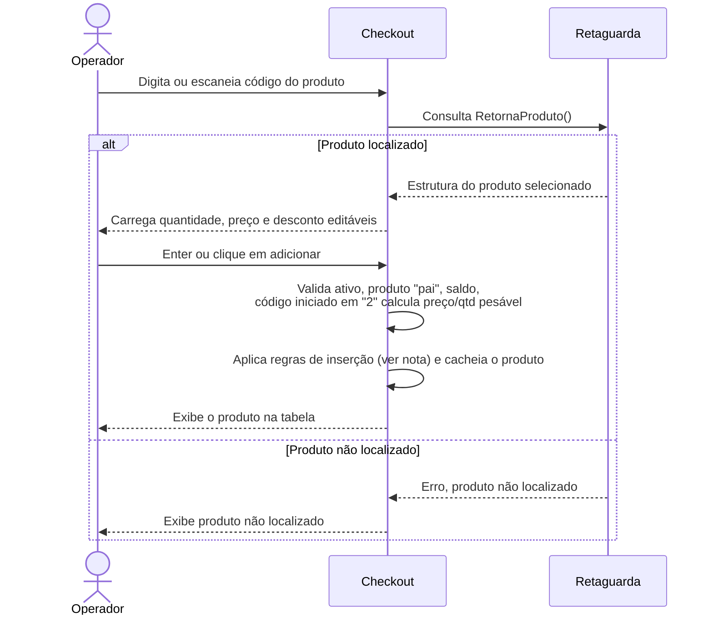
```mermaid
sequenceDiagram
    actor Operador
    participant Checkout
    participant Retaguarda

    Operador->>Checkout: Digita ou escaneia código do produto
    Checkout->>Retaguarda: Consulta RetornaProduto()
    alt Produto localizado
        Retaguarda-->>Checkout: Estrutura do produto selecionado
        Checkout-->>Operador: Carrega quantidade, preço e desconto editáveis
        Operador->>Checkout: Enter ou clique em adicionar
        Checkout->>Checkout: Valida ativo, produto "pai", saldo,<br/>código iniciado em "2" calcula preço/qtd pesável
        Checkout->>Checkout: Aplica regras de inserção (ver nota) e cacheia o produto
        Checkout-->>Operador: Exibe o produto na tabela
    else Produto não localizado
        Retaguarda-->>Checkout: Erro, produto não localizado
        Checkout-->>Operador: Exibe produto não localizado
    end
```

> ⚠️ **Nota**: regras de inserção do diagrama-fonte: só produto ativo; bloqueia sem estoque quando a validação está ativa; preço por quantidade recalcula o inserido e os já lançados; "*" multiplica quantidade × código; desconto não pode exceder o valor do item; bloqueia quantidade/valor zerado ou negativo; permite repetição (agrupa); bloqueia "produto pai" (fora de escopo — ver `ARCHITECTURE.md` seção 5, item 4); limpa os campos após inserir; bloqueia inserção após pagamento aprovado (`ARCHITECTURE.md` seção 7, item 17 — ainda em análise).

### Cancelar produto (sequência)

Fonte: `Diagrama de sequencia/Cancelar produto.drawio`. Remoção de um item já lançado no carrinho.

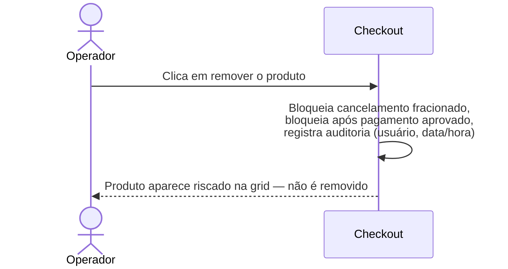
```mermaid
sequenceDiagram
    actor Operador
    participant Checkout

    Operador->>Checkout: Clica em remover o produto
    Checkout->>Checkout: Bloqueia cancelamento fracionado,<br/>bloqueia após pagamento aprovado,<br/>registra auditoria (usuário, data/hora)
    Checkout-->>Operador: Produto aparece riscado na grid — não é removido
```

> ✅ **Confirmado**: item cancelado permanece na grid, riscado — ver `ARCHITECTURE.md` seções 4 e 5, AD-015.

### Condição de pagamento (sequência)

Fonte: `Diagrama de sequencia/Condição de Pagamento.drawio`. Seleção da condição, aplicada sobre o payload de login.

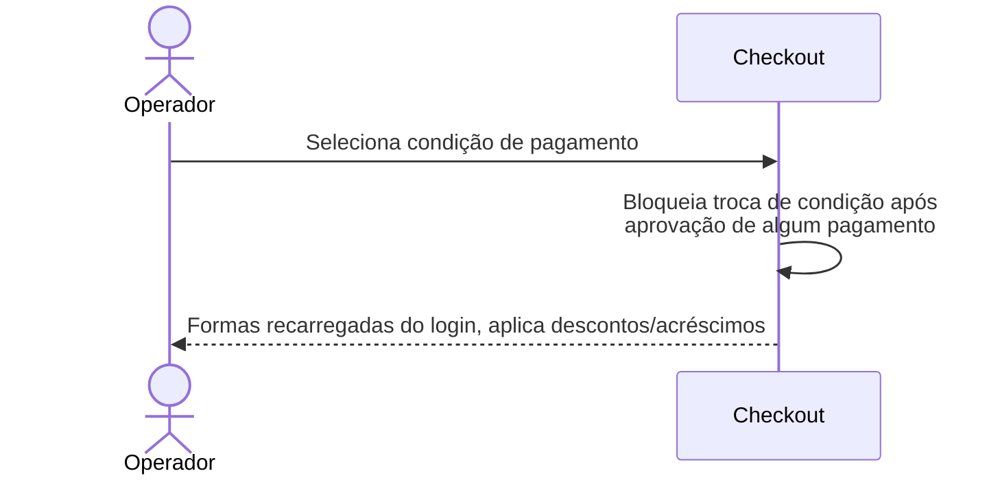
```mermaid
sequenceDiagram
    actor Operador
    participant Checkout

    Operador->>Checkout: Seleciona condição de pagamento
    Checkout->>Checkout: Bloqueia troca de condição após<br/>aprovação de algum pagamento
    Checkout-->>Operador: Formas recarregadas do login, aplica descontos/acréscimos
```

### Adiciona pagamentos

Fonte: `Diagrama de sequencia/Adiciona Pagamentos.drawio`. Cinco blocos independentes, um por forma de pagamento.

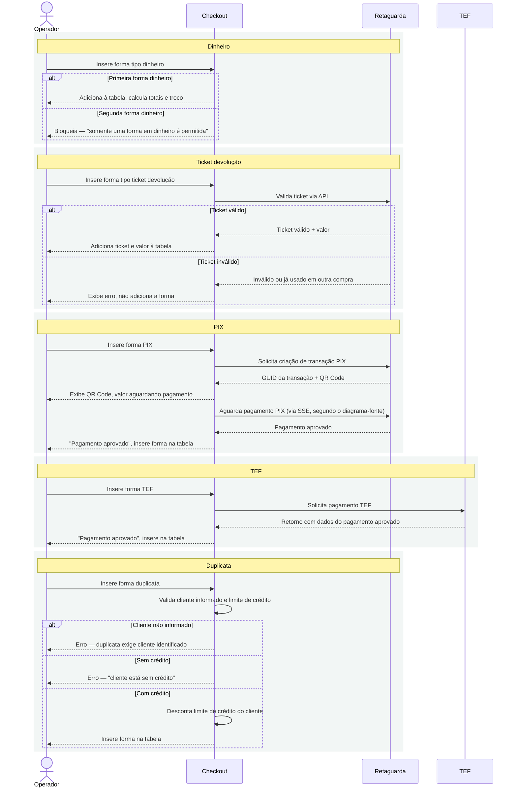
```mermaid
sequenceDiagram
    actor Operador
    participant Checkout
    participant Retaguarda
    participant TEF

    rect rgba(39,99,88,0.06)
    note over Operador,Retaguarda: Dinheiro
    Operador->>Checkout: Insere forma tipo dinheiro
    alt Primeira forma dinheiro
        Checkout-->>Operador: Adiciona à tabela, calcula totais e troco
    else Segunda forma dinheiro
        Checkout-->>Operador: Bloqueia — "somente uma forma em dinheiro é permitida"
    end
    end

    rect rgba(39,99,88,0.06)
    note over Operador,Retaguarda: Ticket devolução
    Operador->>Checkout: Insere forma tipo ticket devolução
    Checkout->>Retaguarda: Valida ticket via API
    alt Ticket válido
        Retaguarda-->>Checkout: Ticket válido + valor
        Checkout-->>Operador: Adiciona ticket e valor à tabela
    else Ticket inválido
        Retaguarda-->>Checkout: Inválido ou já usado em outra compra
        Checkout-->>Operador: Exibe erro, não adiciona a forma
    end
    end

    rect rgba(39,99,88,0.06)
    note over Operador,Retaguarda: PIX
    Operador->>Checkout: Insere forma PIX
    Checkout->>Retaguarda: Solicita criação de transação PIX
    Retaguarda-->>Checkout: GUID da transação + QR Code
    Checkout-->>Operador: Exibe QR Code, valor aguardando pagamento
    Checkout->>Retaguarda: Aguarda pagamento PIX (via SSE, segundo o diagrama-fonte)
    Retaguarda-->>Checkout: Pagamento aprovado
    Checkout-->>Operador: "Pagamento aprovado", insere forma na tabela
    end

    rect rgba(39,99,88,0.06)
    note over Operador,TEF: TEF
    Operador->>Checkout: Insere forma TEF
    Checkout->>TEF: Solicita pagamento TEF
    TEF-->>Checkout: Retorno com dados do pagamento aprovado
    Checkout-->>Operador: "Pagamento aprovado", insere na tabela
    end

    rect rgba(39,99,88,0.06)
    note over Operador,Retaguarda: Duplicata
    Operador->>Checkout: Insere forma duplicata
    Checkout->>Checkout: Valida cliente informado e limite de crédito
    alt Cliente não informado
        Checkout-->>Operador: Erro — duplicata exige cliente identificado
    else Sem crédito
        Checkout-->>Operador: Erro — "cliente está sem crédito"
    else Com crédito
        Checkout->>Checkout: Desconta limite de crédito do cliente
        Checkout-->>Operador: Insere forma na tabela
    end
    end
```

> ⚠️ **Divergência**: confirmado (2026-08-20) que o status do PIX não será via SSE — o Checkout consulta ativamente o endpoint `StatusPIX`. O texto "via SSE" acima é fiel ao diagrama-fonte, não ao comportamento real. Ver AD-012.

### Descontos e acréscimos (sequência)

Fonte: `Diagrama de sequencia/Descontos e Acréscimos.drawio`. Limites aplicados sobre o total da venda.

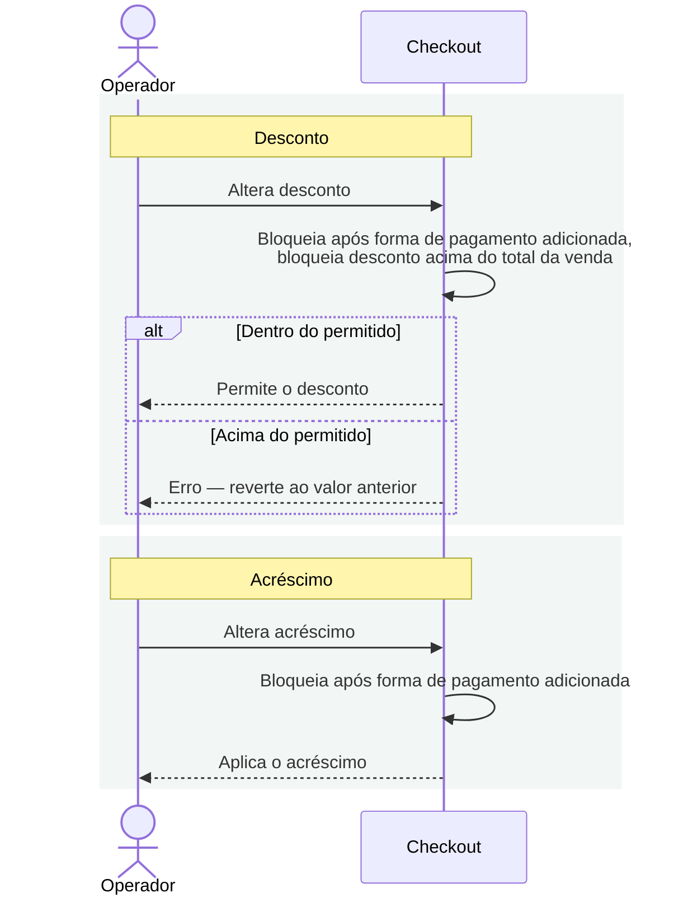
```mermaid
sequenceDiagram
    actor Operador
    participant Checkout

    rect rgba(39,99,88,0.06)
    note over Operador,Checkout: Desconto
    Operador->>Checkout: Altera desconto
    Checkout->>Checkout: Bloqueia após forma de pagamento adicionada,<br/>bloqueia desconto acima do total da venda
    alt Dentro do permitido
        Checkout-->>Operador: Permite o desconto
    else Acima do permitido
        Checkout-->>Operador: Erro — reverte ao valor anterior
    end
    end

    rect rgba(39,99,88,0.06)
    note over Operador,Checkout: Acréscimo
    Operador->>Checkout: Altera acréscimo
    Checkout->>Checkout: Bloqueia após forma de pagamento adicionada
    Checkout-->>Operador: Aplica o acréscimo
    end
```

### Emissão NFCe

Fonte: `Diagrama de sequencia/Emissão NFCe.drawio`. Finalização — transmissão do rascunho completo ao ERP.

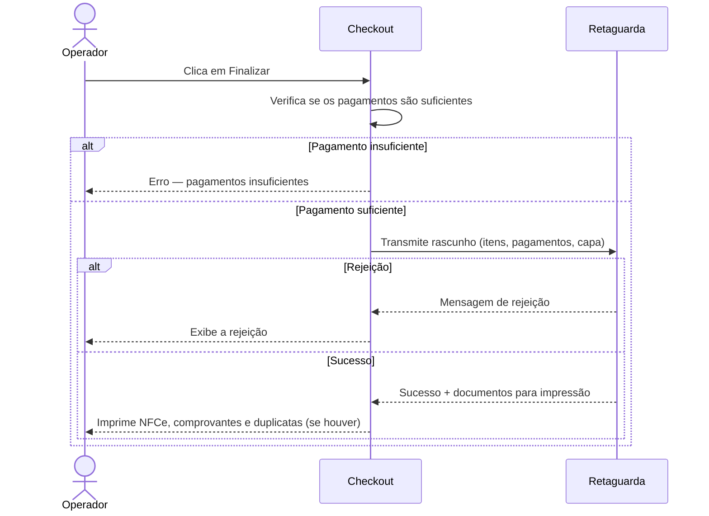
```mermaid
sequenceDiagram
    actor Operador
    participant Checkout
    participant Retaguarda

    Operador->>Checkout: Clica em Finalizar
    Checkout->>Checkout: Verifica se os pagamentos são suficientes
    alt Pagamento insuficiente
        Checkout-->>Operador: Erro — pagamentos insuficientes
    else Pagamento suficiente
        Checkout->>Retaguarda: Transmite rascunho (itens, pagamentos, capa)
        alt Rejeição
            Retaguarda-->>Checkout: Mensagem de rejeição
            Checkout-->>Operador: Exibe a rejeição
        else Sucesso
            Retaguarda-->>Checkout: Sucesso + documentos para impressão
            Checkout-->>Operador: Imprime NFCe, comprovantes e duplicatas (se houver)
        end
    end
```

### Importação e faturamento de DAV

Fonte: `Diagrama de sequencia/Importação e Faturamento DAV.drawio`. Entrada alternativa na venda, a partir de um documento existente no ERP.

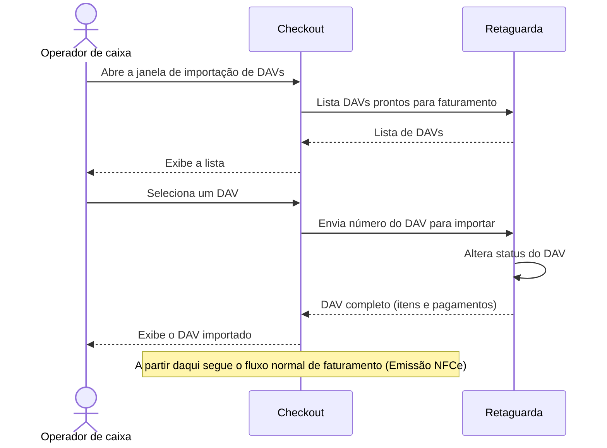
```mermaid
sequenceDiagram
    actor Operador as Operador de caixa
    participant Checkout
    participant Retaguarda

    Operador->>Checkout: Abre a janela de importação de DAVs
    Checkout->>Retaguarda: Lista DAVs prontos para faturamento
    Retaguarda-->>Checkout: Lista de DAVs
    Checkout-->>Operador: Exibe a lista
    Operador->>Checkout: Seleciona um DAV
    Checkout->>Retaguarda: Envia número do DAV para importar
    Retaguarda->>Retaguarda: Altera status do DAV
    Retaguarda-->>Checkout: DAV completo (itens e pagamentos)
    Checkout-->>Operador: Exibe o DAV importado
    note over Checkout: A partir daqui segue o fluxo normal de faturamento (Emissão NFCe)
```

> ✅ **Confirmado**: endpoints reais no contrato: `GET /ApiCentriumOAuth/ListaDAVs` e `GET /ApiCentriumOAuth/GetDAV`. Documentado em `ARCHITECTURE.md` seção 5, AD-013.

---

## Fluxogramas — Operador de Caixa

### Fazer login (operador)

Fonte: `Fluxogramas/Operador de Caixa/Fazer Login.drawio`.

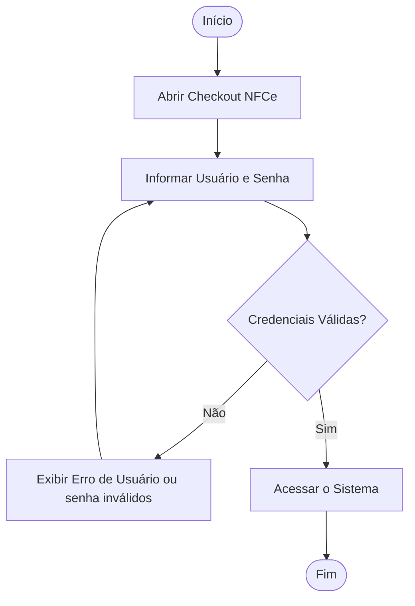
```mermaid
flowchart TD
    A(["Início"]) --> B["Abrir Checkout NFCe"]
    B --> C["Informar Usuário e Senha"]
    C --> D{"Credenciais Válidas?"}
    D -- Não --> E["Exibir Erro de Usuário ou senha inválidos"]
    E --> C
    D -- Sim --> F["Acessar o Sistema"]
    F --> G(["Fim"])
```

> ⚠️ **Divergência**: mesma ressalva do diagrama de sequência de Login — não há tela manual de usuário/senha no Checkout real.

### Identificar ou cadastrar cliente

Fonte: `Fluxogramas/Operador de Caixa/Identificar ou Cadastrar Clientes.drawio`.

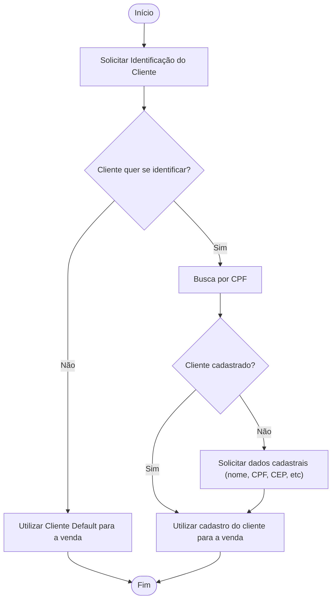
```mermaid
flowchart TD
    A(["Início"]) --> B["Solicitar Identificação do Cliente"]
    B --> C{"Cliente quer se identificar?"}
    C -- Não --> D["Utilizar Cliente Default para a venda"]
    D --> E(["Fim"])
    C -- Sim --> F["Busca por CPF"]
    F --> G{"Cliente cadastrado?"}
    G -- Sim --> H["Utilizar cadastro do cliente para a venda"]
    H --> E
    G -- Não --> I["Solicitar dados cadastrais (nome, CPF, CEP, etc)"]
    I --> H
```

### Consultar produtos (fluxograma)

Fonte: `Fluxogramas/Operador de Caixa/Consultar Produtos.drawio`.

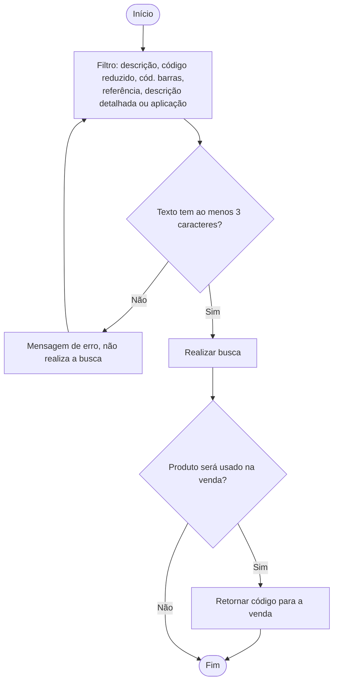
```mermaid
flowchart TD
    A(["Início"]) --> B["Filtro: descrição, código reduzido, cód. barras,<br/>referência, descrição detalhada ou aplicação"]
    B --> C{"Texto tem ao menos 3 caracteres?"}
    C -- Não --> D["Mensagem de erro, não realiza a busca"]
    D --> B
    C -- Sim --> E["Realizar busca"]
    E --> F{"Produto será usado na venda?"}
    F -- Sim --> G["Retornar código para a venda"]
    G --> H(["Fim"])
    F -- Não --> H
```

### Vender produtos (fluxograma)

Fonte: `Fluxogramas/Operador de Caixa/Vender Produtos.drawio`. Edição de quantidade, preço por faixa e desconto antes de inserir.

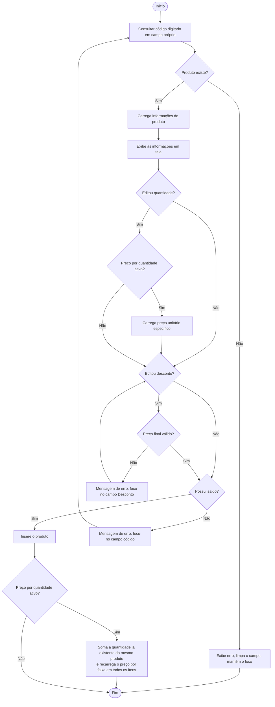
```mermaid
flowchart TD
    A(["Início"]) --> B["Consultar código digitado em campo próprio"]
    B --> C{"Produto existe?"}
    C -- Não --> D["Exibe erro, limpa o campo, mantém o foco"]
    D --> Z(["Fim"])
    C -- Sim --> E["Carrega informações do produto"]
    E --> F["Exibe as informações em tela"]
    F --> G{"Editou quantidade?"}
    G -- Sim --> H{"Preço por quantidade ativo?"}
    G -- Não --> L{"Editou desconto?"}
    H -- Sim --> K["Carrega preço unitário específico"]
    K --> L
    H -- Não --> L
    L -- Sim --> M{"Preço final válido?"}
    L -- Não --> S{"Possui saldo?"}
    M -- Não --> O["Mensagem de erro, foco no campo Desconto"]
    O --> L
    M -- Sim --> S
    S -- Sim --> N["Insere o produto"]
    S -- Não --> V["Mensagem de erro, foco no campo código"]
    V --> B
    N --> T{"Preço por quantidade ativo?"}
    T -- Sim --> U["Soma a quantidade já existente do mesmo produto<br/>e recarrega o preço por faixa em todos os itens"]
    U --> Z
    T -- Não --> Z
```

> ⚠️ **Nota**: transcrição fiel do diagrama-fonte — "Exibe erro, limpa o campo" leva direto ao Fim, não retorna ao início do fluxo.

### Cancelar produtos (fluxograma)

Fonte: `Fluxogramas/Operador de Caixa/Cancelar Produtos.drawio`.

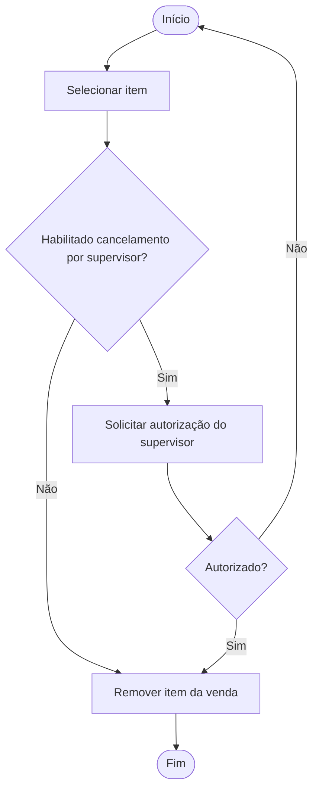
```mermaid
flowchart TD
    A(["Início"]) --> B["Selecionar item"]
    B --> C{"Habilitado cancelamento por supervisor?"}
    C -- Sim --> D["Solicitar autorização do supervisor"]
    C -- Não --> E["Remover item da venda"]
    D --> F{"Autorizado?"}
    F -- Sim --> E
    F -- Não --> A
    E --> G(["Fim"])
```

> ⚠️ **Descoberta nova**: configuração "cancelamento habilitado por supervisor" — quando ativa, exige aprovação (ver bloco Supervisor abaixo). Ainda não documentado em `ARCHITECTURE.md`.

### Selecionar condição de pagamento

Fonte: `Fluxogramas/Operador de Caixa/Selecionar Condição de Pagamento.drawio`.

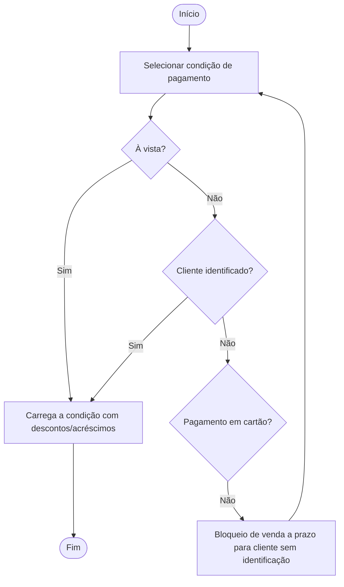
```mermaid
flowchart TD
    A(["Início"]) --> B["Selecionar condição de pagamento"]
    B --> C{"À vista?"}
    C -- Sim --> D["Carrega a condição com descontos/acréscimos"]
    C -- Não --> E{"Cliente identificado?"}
    E -- Sim --> D
    E -- Não --> F{"Pagamento em cartão?"}
    F -- Não --> G["Bloqueio de venda a prazo para cliente sem identificação"]
    G --> B
    D --> H(["Fim"])
```

> ⚠️ **Nota**: o caminho "Sim" de "Pagamento em cartão?" não tem seta de saída no diagrama original — gap da fonte, não do Checkout.

### Registrar pagamentos

Fonte: `Fluxogramas/Operador de Caixa/Registra Pagamentos.drawio`.

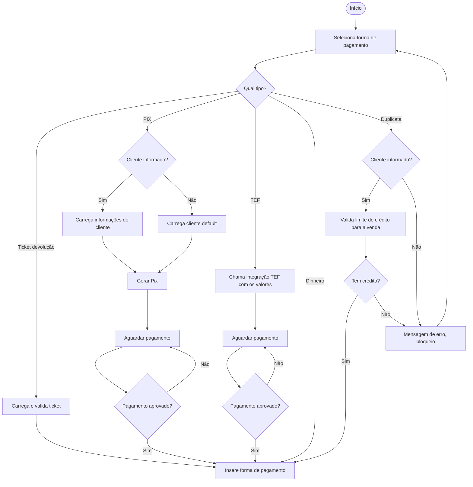
```mermaid
flowchart TD
    A(["Início"]) --> B["Seleciona forma de pagamento"]
    B --> C{"Qual tipo?"}
    C -- "Ticket devolução" --> D["Carrega e valida ticket"]
    D --> P["Insere forma de pagamento"]
    C -- PIX --> E{"Cliente informado?"}
    E -- Sim --> F["Carrega informações do cliente"]
    E -- Não --> G["Carrega cliente default"]
    F --> H["Gerar Pix"]
    G --> H
    H --> I["Aguardar pagamento"]
    I --> J{"Pagamento aprovado?"}
    J -- Não --> I
    J -- Sim --> P
    C -- TEF --> K["Chama integração TEF com os valores"]
    K --> L["Aguardar pagamento"]
    L --> M{"Pagamento aprovado?"}
    M -- Não --> L
    M -- Sim --> P
    C -- Dinheiro --> P
    C -- Duplicata --> N{"Cliente informado?"}
    N -- Sim --> O["Valida limite de crédito para a venda"]
    N -- Não --> Q["Mensagem de erro, bloqueio"]
    O --> R{"Tem crédito?"}
    R -- Sim --> P
    R -- Não --> Q
    Q --> B
```

### Aplicar descontos e acréscimos (fluxograma)

Fonte: `Fluxogramas/Operador de Caixa/Aplicar Descontos e Acréscimos.drawio`.

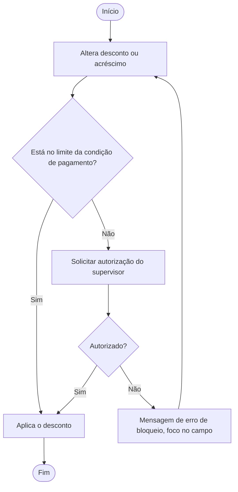
```mermaid
flowchart TD
    A(["Início"]) --> B["Altera desconto ou acréscimo"]
    B --> C{"Está no limite da condição de pagamento?"}
    C -- Sim --> D["Aplica o desconto"]
    C -- Não --> E["Solicitar autorização do supervisor"]
    E --> F{"Autorizado?"}
    F -- Sim --> D
    F -- Não --> G["Mensagem de erro de bloqueio, foco no campo"]
    G --> B
    D --> H(["Fim"])
```

> ⚠️ **Descoberta nova**: desconto acima do limite da condição de pagamento pode ser liberado por aprovação de supervisor — mecanismo distinto do "bloqueio pós-pagamento" já registrado como pendente em `ARCHITECTURE.md` seção 7, item 17.

### DAV (fluxograma)

Fonte: `Fluxogramas/Operador de Caixa/DAV.drawio`.

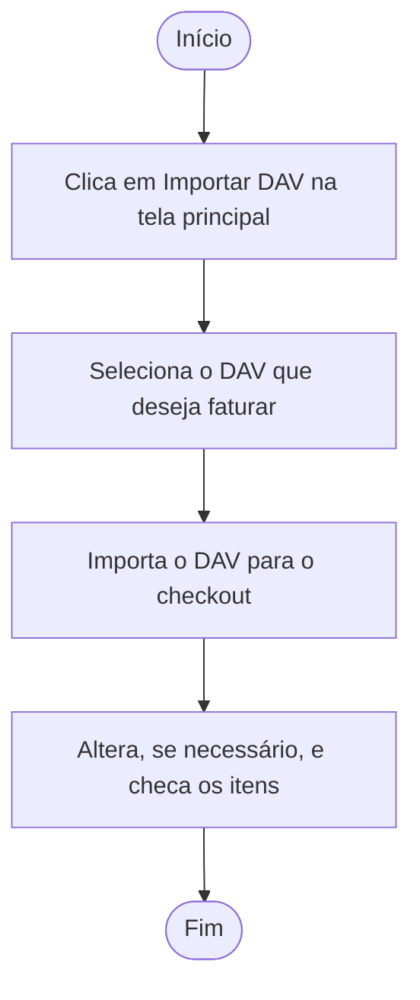
```mermaid
flowchart TD
    A(["Início"]) --> B["Clica em Importar DAV na tela principal"]
    B --> C["Seleciona o DAV que deseja faturar"]
    C --> D["Importa o DAV para o checkout"]
    D --> E["Altera, se necessário, e checa os itens"]
    E --> F(["Fim"])
```

---

## Fluxogramas — Supervisor

### Aprovar cancelamento

Fonte: `Fluxogramas/Supervisor/Aprovar Cancelamento.drawio`.

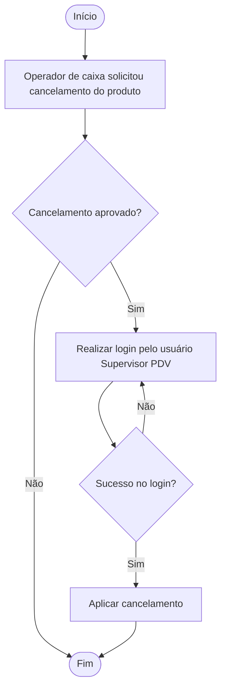
```mermaid
flowchart TD
    A(["Início"]) --> B["Operador de caixa solicitou cancelamento do produto"]
    B --> C{"Cancelamento aprovado?"}
    C -- Sim --> D["Realizar login pelo usuário Supervisor PDV"]
    C -- Não --> E(["Fim"])
    D --> F{"Sucesso no login?"}
    F -- Não --> D
    F -- Sim --> G["Aplicar cancelamento"]
    G --> E
```

### Aprovar desconto

Fonte: `Fluxogramas/Supervisor/Aprovar Desconto.drawio`.

```mermaid
flowchart TD
    A(["Início"]) --> B["Operador de caixa solicitou aprovação de desconto"]
    B --> C{"Desconto aprovado?"}
    C -- Sim --> D["Realizar login pelo usuário Supervisor PDV"]
    C -- Não --> E["Reverter desconto"]
    E --> F(["Fim"])
    D --> G{"Sucesso no login?"}
    G -- Não --> D
    G -- Sim --> H["Aplicar desconto"]
    H --> F
```

### Fazer login (supervisor)

Fonte: `Fluxogramas/Supervisor/Fazer Login.drawio` — idêntico, célula a célula, ao "Fazer login" do Operador de Caixa acima.

```mermaid
flowchart TD
    A(["Início"]) --> B["Abrir Checkout NFCe"]
    B --> C["Informar Usuário e Senha"]
    C --> D{"Credenciais Válidas?"}
    D -- Não --> E["Exibir Erro de Usuário ou senha inválidos"]
    E --> C
    D -- Sim --> F["Acessar o Sistema"]
    F --> G(["Fim"])
```

> ⚠️ **Descoberta nova**: as telas "Aprovar cancelamento" e "Aprovar desconto" pedem login manual do supervisor (usuário/senha) dentro do próprio Checkout — um mecanismo diferente da sessão do operador (AD-002/AD-016), ainda sem tratamento em `ARCHITECTURE.md`. Precisa de alinhamento: é um modal de reautenticação, e usa qual endpoint?

---

## Display secundário

### Tela do cliente

Fonte: `Fluxogramas/Display secundário/Display.drawio`. Tela voltada para o cliente, na frente do caixa.

```mermaid
flowchart TD
    A(["Início"]) --> B["Exibe imagem, grava em contexto"]
    B --> C{"Pagamento em PIX?"}
    C -- Não --> B
    C -- Sim --> D["Exibe QR Code"]
    D --> E{"Pagamento aprovado?"}
    E -- Não --> D
    E -- Sim --> F["Agradecer pela compra"]
    F --> G(["Fim"])
```

> ⚠️ **Descoberta nova**: recurso de segunda tela (voltada ao cliente) inteiramente ausente de `ARCHITECTURE.md` — precisa de decisão sobre se entra no escopo do produto.
